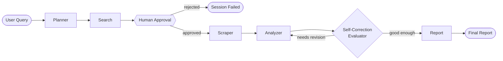

<div align="center">

# 🔬 TesseractResearch

**An autonomous AI research agent with Human-in-the-Loop approval, built on LangGraph.**

Give it a query. It plans, searches, waits for your sign-off, scrapes, analyzes, self-corrects, and hands you back a report — all through a real API you can watch progress on in real time.

[](https://www.python.org/)
[](https://fastapi.tiangolo.com/)
[](https://langchain-ai.github.io/langgraph/)
[](https://github.com/pgvector/pgvector)
[](https://redis.io/)
[](LICENSE)

[Live Demo](https://tesseractresearch.ziayd-usf.workers.dev) · [Report Bug](https://github.com/zeyadusf/TesseractResearch/issues) · [Releases](https://github.com/zeyadusf/TesseractResearch/releases)

</div>

---

## Table of Contents

- [Overview](#overview)
- [How It Works](#how-it-works)
- [Key Features](#key-features)
- [Architecture](#architecture)
- [Tech Stack](#tech-stack)
- [API Reference](#api-reference)
- [Getting Started](#getting-started)
- [Configuration](#configuration)
- [Project Structure](#project-structure)
- [Deployment](#-deployment)
- [Author](#author)

---

## Overview

TesseractResearch is a **production-oriented autonomous research agent**, not a toy demo. A user submits a research query, and a LangGraph state machine takes over: it plans a search strategy, executes real web searches, **pauses and waits for explicit human approval** before spending any scraping/analysis budget on the results, then scrapes sources, synthesizes an analysis, and produces a final structured report — with a self-correction loop that lets the agent evaluate and retry its own output before it reaches the user.

Every external dependency in the pipeline (LLMs, search, scraping) is wrapped behind a **provider/dispatcher pattern** with Redis-backed usage tracking, so the agent degrades gracefully — round-robining, falling back, or skipping a provider — instead of dying the moment one API key hits a rate limit.

This is the second project in the Tesseract series, following [TesseractRAG](https://github.com/zeyadusf/TesseractRAG).

## How It Works



1. **Planner** breaks the query into a search strategy.
2. **Search** runs it against live web-search providers.
3. **Approval (HITL)** — the graph *actually pauses* via LangGraph's `interrupt()` and persists to Postgres. The user reviews the sources and approves or rejects through the API before a single token is spent scraping or analyzing.
4. **Scraper** pulls full page content from the approved sources.
5. **Analyzer** synthesizes findings, with a self-correction evaluator loop that can send the analysis back for revision before it's accepted.
6. **Report** compiles everything into the final deliverable.

Because the interrupt is a real suspension of the graph (not a polling hack), a session can sit paused for approval indefinitely and resume exactly where it left off.

## Key Features

- 🧠 **Human-in-the-Loop by design** — `interrupt()`-based pause/resume, not a fake "confirm" button; state is checkpointed to Postgres so approval can happen minutes or days later.
- 🔁 **Self-correcting analysis loop** — the analyzer's output is evaluated and can be sent back for another pass before reaching the report stage.
- 🌐 **Multi-provider LLM dispatch** with per-node primary + ordered fallback chains (Groq, Mistral, Hugging Face, Cerebras) and automatic retry-with-truncation when a fallback model's rate limit rejects a large request.
- 🔎 **Multi-provider search dispatch** (Tavily → Serper → DuckDuckGo) using Redis credit-zone tracking (green/yellow/red) so paid quota is spent efficiently and the pipeline never fully stalls.
- 🕷️ **Multi-provider scraping dispatch** (Firecrawl → Jina → BeautifulSoup) with the same green/yellow/red credit-zone logic and round-robin behavior once a provider approaches its limit.
- 📡 **Real-time progress via Server-Sent Events** — the frontend polls the LangGraph checkpoint every 2s and streams step transitions to the client.
- 💻 **Production single-file frontend** — no build step, no framework: a single responsive HTML/CSS/JS file with an off-canvas mobile drawer, a from-scratch Markdown renderer, and dynamic sidebar TOC/Sources/Notes extraction.
- 🗄️ **Async all the way down** — SQLAlchemy `AsyncSession` injected via FastAPI DI, `AsyncPostgresSaver` managed through the app lifespan, `flush()`-not-`commit()` inside repositories to keep transaction boundaries at the service layer.

## Architecture

**Agent core (`app/agent`)** — LangGraph graph definition, node implementations, and Postgres-backed checkpoint memory (`AsyncPostgresSaver`).

**API (`app/api`)** — FastAPI app exposing the research lifecycle endpoints and an SSE progress stream (see [API Reference](#api-reference)).

**LLM layer (`app/llm`)** — `LLMDispatcher` maps each node to a primary model with an ordered fallback chain, and retries with a truncated payload if a smaller free-tier model rejects the request as too large for its token-per-minute cap.

**Tools (`app/tools`)** — Independent `search` and `scraper` dispatchers, each provider-agnostic behind a common base interface, with Redis-based `ProviderUsageTracker` instances enforcing soft/hard usage thresholds per provider.

**Database (`app/db`)** — SQLAlchemy async models, Alembic migrations, and repositories for research sessions, reports, and workflow checkpoints.

**Frontend (`frontend/index.html`)** — a single-file client wired directly to the FastAPI endpoints, with no separate build pipeline.

## Tech Stack

| Layer | Choices |
|---|---|
| **Orchestration** | LangGraph 1.2.6 (with `interrupt()`-based HITL, `AsyncPostgresSaver`) |
| **API** | FastAPI, Uvicorn, SlowAPI (rate limiting), SSE |
| **LLM Providers** | Groq · Mistral · Hugging Face · Cerebras (per-node primary + fallback chain) |
| **Search Providers** | Tavily · Serper · DuckDuckGo |
| **Scraper Providers** | Firecrawl · Jina · BeautifulSoup |
| **Database** | PostgreSQL (pgvector image) via SQLAlchemy (async) + Alembic |
| **Cache / Usage Tracking** | Redis |
| **Frontend** | Vanilla HTML/CSS/JS, single file, no build step |
| **Observability** | LangSmith tracing |
| **Containerization** | Docker Compose (app, pgvector, redis, RedisInsight) |

## API Reference

Full OpenAPI schema is available at `/docs` (Swagger UI) once the app is running. Summary:

| Method | Endpoint | Description |
|---|---|---|
| `POST` | `/research` | Start a research session. Runs the graph until it pauses at the approval interrupt; returns `session_id`. |
| `GET` | `/research/{session_id}` | Get current session state — step, status, approval flag, errors, sources. |
| `POST` | `/research/{session_id}/approve` | Approve or reject the search results. Approving resumes the graph through scrape → analyze → report; rejecting fails the session. |
| `GET` | `/research/{session_id}/report` | Fetch the final persisted report (404 until complete). |
| `GET` | `/research/{session_id}/events` | Server-Sent Events stream of pipeline progress, polling the checkpoint every 2s. |
| `GET` | `/health` | Liveness probe. |

## Getting Started

### Prerequisites

- Python **3.11.15**
- Docker & Docker Compose
- API keys for at least one provider in each category (LLM / search / scraper) — see [Configuration](#configuration)

### Run with Docker Compose (recommended)

```bash
git clone https://github.com/zeyadusf/TesseractResearch.git
cd TesseractResearch

cp .env.example .env
# fill in your API keys and DB credentials in .env

docker compose up --build
```

This starts:
- `app` — the FastAPI backend on `:8000`
- `pgvector` — PostgreSQL (pgvector image) on `:5432`
- `redis` — Redis on `:6379`
- `redisinsight` — Redis GUI on `:5540`

Then open `frontend/index.html` directly in your browser and point it at `http://localhost:8000` in the settings modal.

### Run locally without Docker

```bash
python -m venv .venv
source .venv/bin/activate  # or .venv\Scripts\activate on Windows

pip install -r requirements.txt

# make sure Postgres (pgvector) and Redis are running and reachable,
# then apply migrations:
cd app/db
alembic upgrade head

# from the project root:
uvicorn app.api.main:app --reload
```

## Configuration

Copy `.env.example` to `.env` and fill in the values relevant to your setup:

```dotenv
APP_NAME="TesseractResearch"
APP_VERSION="1.0.0"
DEBUG=False

# Redis
REDIS_URL='redis://localhost:6379'

# Database
POSTGRES_USERNAME="postgres"
POSTGRES_PASSWORD="<your-password>"
POSTGRES_DB="tessagent"
POSTGRES_HOST="localhost"
POSTGRES_PORT=5432
DATABASE_URL="postgresql+asyncpg://postgres:<your-password>@localhost:5432/tessagent?ssl=disable"

# Search
TAVILY_API_KEY=
SERPER_API_KEY=

# Scraper
FIRECRAWL_API_KEY=

SEARCH_MAX_RESULTS=15
STRIP_IMAGES='True'
SCRAPER_TARGET_SOURCES=5
MAX_CHARS_PER_SOURCE=16000

# LLMs
OPENAI_API_KEY=
HUGGINGFACEHUB_API_TOKEN=
GROQ_API_KEY=
MISTRAL_API_KEY=
CEREBRAS_API_KEY=

# Observability (optional)
LANGSMITH_TRACING=True
LANGSMITH_API_KEY=
LANGSMITH_PROJECT='tesseract_research'
LANGSMITH_ENDPOINT=https://api.smith.langchain.com
```

> You don't need every provider key — each dispatcher falls back gracefully — but at least one search provider and one scraper provider are required for a session to complete, and at least one LLM provider per node's fallback chain.

## Project Structure

```
TesseractResearch/
├─ app/
│  ├─ agent/       # LangGraph graph, nodes, checkpoint memory, state
│  ├─ api/         # FastAPI app + routers
│  ├─ core/        # config, dependencies, logging
│  ├─ db/          # SQLAlchemy schema, Alembic migrations, repositories
│  ├─ llm/         # LLM dispatcher + providers (Groq/Mistral/HF/Cerebras)
│  ├─ models/      # Pydantic/enum models shared across the app
│  ├─ service/     # research + report service layer
│  └─ tools/       # search & scraper dispatchers + providers, usage tracker
├─ frontend/
│  └─ index.html   # single-file production frontend
├─ test/           # provider test suites + recorded test results
├─ docker-compose.yml
└─ requirements.txt
```
<!-- 
## Roadmap

- [ ] Public live deployment
- [ ] Demo video / GIF walkthrough
- [ ] Multi-session dashboard on the frontend
- [ ] Expanded automated test coverage in CI (`tools-tests.yml`) -->


## 🚀 Deployment

TesseractResearch is deployed using a fully managed, free-tier-friendly stack:

| Component        | Provider                | Notes                                                            |
|-------------------|--------------------------|-------------------------------------------------------------------|
| **Backend (API)** | [Railway](https://railway.app) | FastAPI + LangGraph agent, deployed via Dockerfile from this repo |
| **Database**      | [Supabase](https://supabase.com) | Managed PostgreSQL, used for LangGraph checkpoints, research sessions, and reports |
| **Cache / Rate-limiting** | [Upstash](https://upstash.com) | Serverless Redis for credit-zone tracking (green/yellow/red budget system) |
| **Frontend**      | [Cloudflare Workers](https://developers.cloudflare.com/workers/) | Static single-file frontend, served via Workers static assets |

### Architecture Notes

- **Database connections**: Supabase's direct connection is IPv6-only and unreachable from Railway. The app connects through Supabase's **Session Pooler** (port `5432`) for both runtime and Alembic migrations, for IPv4 compatibility.
- **Migrations**: Run manually via `alembic -c app/db/alembic.ini upgrade head` from the project root before each deploy that introduces schema changes.
- **CORS**: The backend explicitly allows the Cloudflare Workers frontend origin in `app/api/main.py`.
- **Frontend/backend split**: The frontend is a static file with no build step, deployed independently from the backend. It talks to the Railway-hosted API over HTTPS (not a relative path), configured via `DEFAULT_API_BASE` in `frontend/index.html`.

### Environment Variables

See `.env.example` for the full list. Key variables:
- `POSTGRES_USERNAME`, `POSTGRES_PASSWORD`, `POSTGRES_HOST`, `POSTGRES_PORT`, `POSTGRES_DATABASE_NAME` — Supabase Session Pooler credentials
- Redis connection string — Upstash (`rediss://` with TLS)
- 
## Author

**Zeyad El-Sayed Yousif**
AI/ML Engineer — NLP, LLMs & Agentic Systems

<div align="center">

[](https://github.com/zeyadusf)
[](https://linkedin.com/in/zeyadusf)
[](https://huggingface.co/zeyadusf)

</div>

